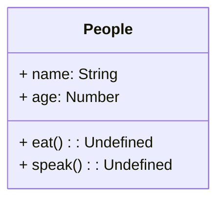
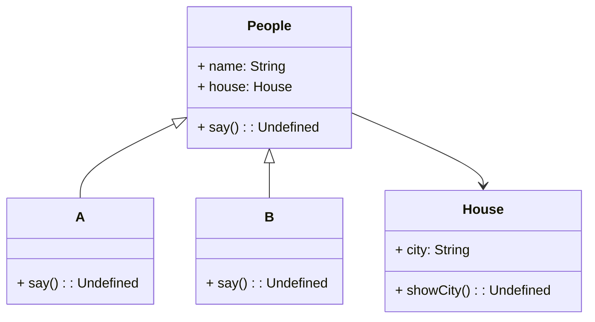

### UML类图

#### 类图练习1

```
class People {
    constructor(name, age) {
        this.name = name
        this.age = age
    }
    eat() {
        console.log(`${this.name} eat something`)
    }
    speak() {
        console.log(`My name is ${this.name},my age is ${this.age}`)
    }
}
```

根据上面的People类画出UML类图




#### 类图练习2



如图所示，空心箭头表示继承，A，B继承自People

实心箭头表示依赖，类People引用了类House