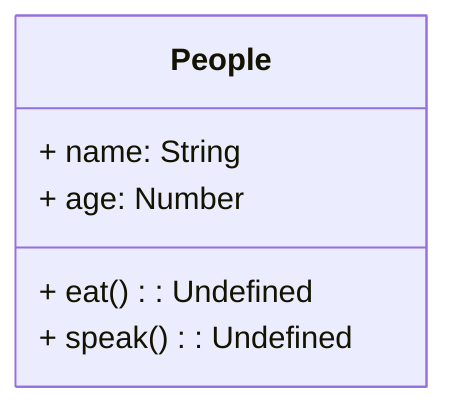
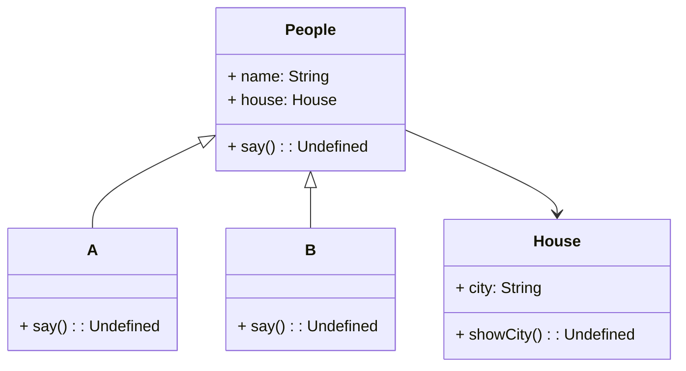

### UML类图

类图符号

```
+ public
- private
# protected
~ default
_ static
```


#### 类图练习1

```
class People {
    constructor(name, age) {
        this.name = name
        this.age = age
    }
    eat() {
        console.log(`${this.name} eat something`)
    }
    speak() {
        console.log(`My name is ${this.name},my age is ${this.age}`)
    }
}
```

根据上面的People类画出UML类图




#### 类图练习2



如图所示，空心箭头表示继承，A，B继承自People

实心箭头表示依赖，类People引用了类House


### 设计原则

SOLID五大设计原则

S - 单一职责原则（Single Responsibility Principle）

接口职责单一，不要承担过多的职责

O - 开放封闭原则（Open Closed Principle）

对扩展开放，对修改封闭

增加新需求时，扩展新代码，而非已有的代码

以下3个JS中较少使用 ——

L - 里氏替换原则

子类能覆盖父类（）

I - 接口替换原则（Interface Segregation Principle）

保持接口独立

D - 依赖倒置原则（Dependence Inversion Principle）

只关注接口而不关注具体类的实现


### 设计模式

创建型（怎么创建对象）

```
工厂模式（工厂方法模式，抽象工厂模式，建造者模式）
单例模式
原型模式
```

组合型

```
适配器模式
装饰器模式
代理模式
外观模式
桥接模式
组合模式
享元模式
```

行为型

```
策略模式
模板方法模式
观察者模式
迭代器模式
职责连模式
命令模式
```

