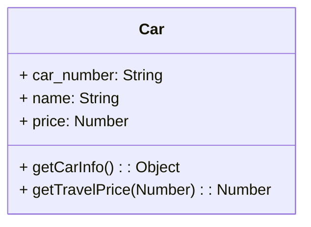
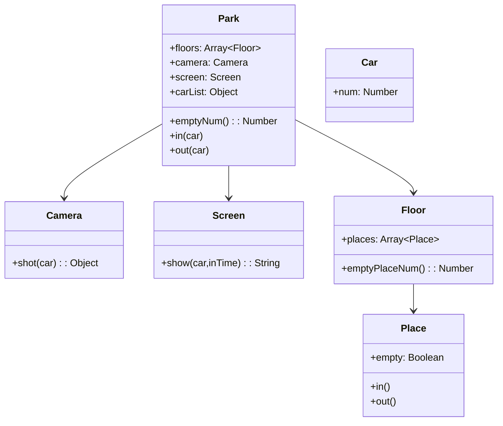

### 打车

打车时，可以打专车或者快车。任何车都有车牌号和名称

不同车价格不同，快车每公里1元，专车每公里2元

行程开始，显示车辆信息

行程结束，显示打车金额（假定每公里5元）

（1）画出`UML`类图

（2）`ES6`语法写出实例



```
class Car {
	constructor(car_number, name, price){
		this.car_number = car_number
		this.name = name
		this.price=price
	}
	getCarInfo(){
		return {
			car_number: this.car_number
			name: this.name
			price: this.price
		}
	}
	getTravelPrice(distance){
		return distance*this.price
	}
}
```


### 停车场

具体代码

```
src\3Elements\parking.js
```

某停车场，分3层，每层100车位

每个车位能监控到车辆的驶入和离开

车辆进入前，显示每层的空余车位数量

车辆进入时，摄像头可识别车牌号和时间

车辆出来时，出口显示器显示车牌号和停车时长

（1）UML类图



